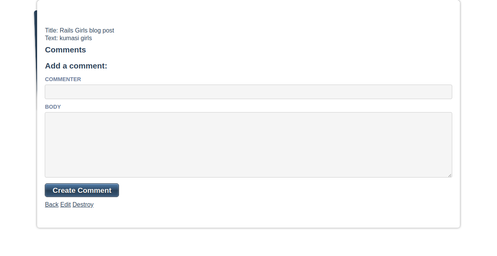

# Blog App

This is a Blog webApp project built with Ruby on Rails in accordance with [Microverse](https://www.microverse.org/) requirements. You can also check out [the odin project](https://www.theodinproject.com/courses/ruby-on-rails/lessons/ruby-on-rails-ruby-on-rails) for more information.

Check Out [blog-app](https://lola-blog-app.herokuapp.com/) for the live version.

**Blog Image**

# Built With

*  Ruby 2.5.3

*  Rails ~> 5.1.7 

*  Heroku

*  Visual Studio Code

# Set up and Configuration

    $ git clone https://github.com/mihrab34/Blog-app

    $ cd  blog-app

    $ run bundle install to install all dependencies in the gem file

    $ run rails server

# Author

[@mihrab34](https://github.com/mihrab34)

# Contribution

Any contributions are **greatly appreciated**

1. Fork the Project
2. Create your Feature Branch (git checkout -b feature/AmazingFeature)
3. Commit your Changes (git commit -m 'Add some AmazingFeature')
4. Push to the Branch (git push origin feature/AmazingFeature)
5. Open a Pull Request
